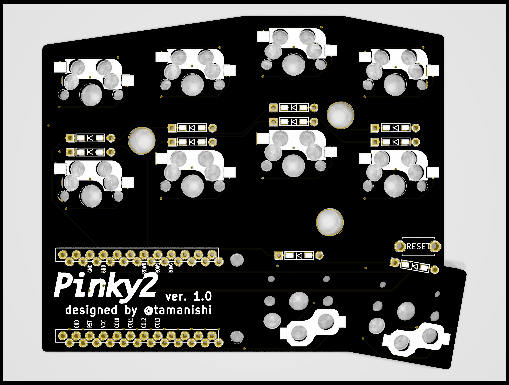
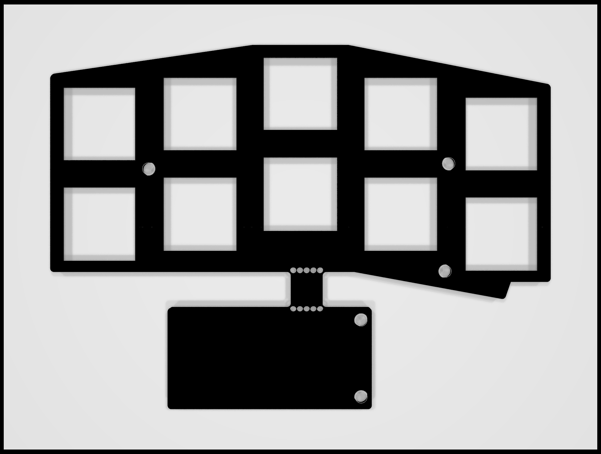
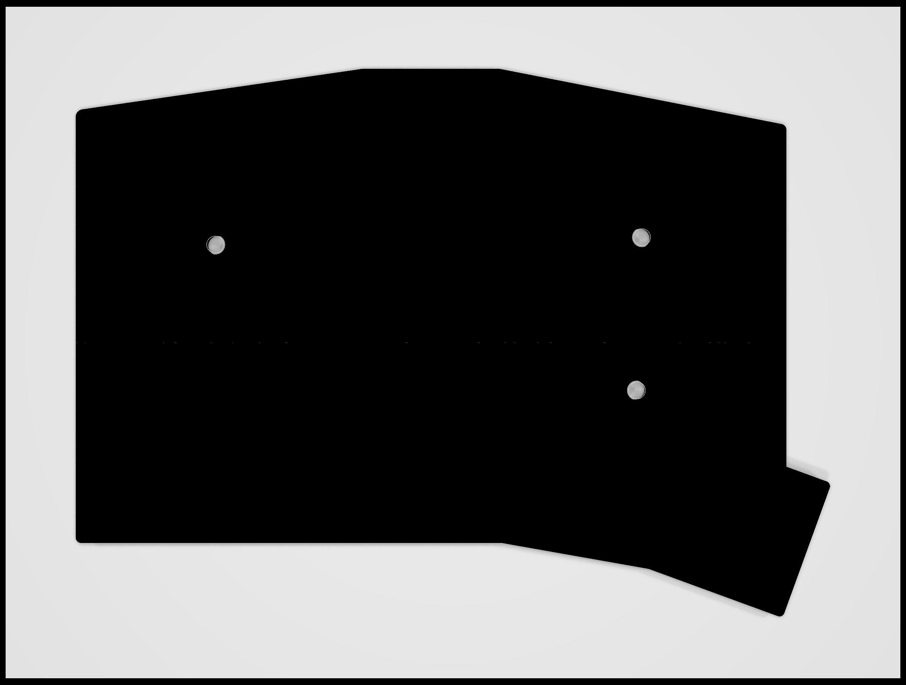

# Pinky2

A 2 x 5 vertically staggered keys and 3 thumb keys reversible macropad for one hand.  
An idea is inspired from [crkbd](https://github.com/foostan/crkbd), [Lily58](https://github.com/kata0510/Lily58), [Ergo42](https://github.com/Biacco42/Ergo42) and [Helix](https://github.com/MakotoKurauchi/helix).  

## TODO: product image
<!--  -->

## Pcb & Plates

## Bill of Materials

| # | name | qty |
| ---: | :--- | ---: |
| 1 | pcb | 1 |
| 2 | top plate | 1 |
| 3 | bottom plate | 1 |
| 4 | Pro Micro | 1 |
| 5 | Conthrough for Pro Micro | 2 |
| 6 | 2 pins tact switch | 1 |
| 7 | diodes (1N4148 or 1N4148W) | 13 |
| 8 | Kailh PCB Sockets (for MX) | 10 |
| 9 | Kailh PCB Sockets (for Choc) | 3 |
| 10 | Cherry MX compatible keyswitches | 10 |
| 11 | Kailh Choc keyswitches | 3 |
| 12 | Cherry MX compatible keycaps | 10 |
| 13 | Kailh Choc compatible keycaps | 3 |
| 14 | 7mm M2 standoffs (for top and bottom plate) | 3 |
| 15 | 5mm M2 standoffs (for Pro Micro cover plate) | 2 |
| 16 | 4mm M2 screws | 5 |
| 17 | rubber cushions | 4 |

## Firmware

See [Quantum Mechanical Keyboard Firmware](https://qmk.fm) and [its Pinky support page](https://github.com/qmk/qmk_firmware/blob/master/keyboards/pinky/readme.md)

## TODOs

- [ ] add build log
